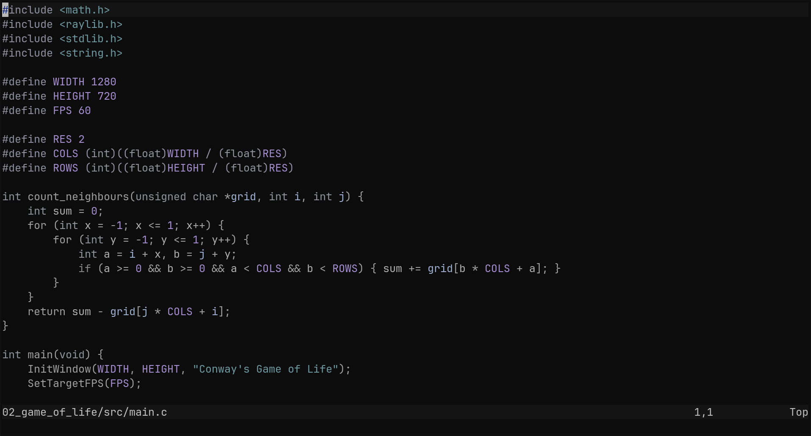

# silence.nvim

A dark, muted Neovim colorscheme I build around shades of grey with subtle color accents.
Designed to reduce visual noise and keep the focus on the code.



## Requirements

- Neovim 0.8+
- A terminal with true color support

## Installation

### lazy.nvim

```lua
{
    "danhat1020/silence.nvim",
    config = function()
        require("silence").setup({
            -- options here (see configuration)
        })
        vim.cmd("colorscheme silence")
    end,
}
```

### packer.nvim

```lua
use {
    "danhat1020/silence.nvim",
        config = function()
            require("silence").setup({
                -- options here (see configuration)
            })
            vim.cmd("colorscheme silence")
        end,
}
```

### vim.pack (native)

```lua
vim.pack.add({ { src = "https://github.com/danhat1020/silence.nvim" } })
-- or
vim.pack.add({ "https://github.com/danhat1020/silence.nvim" })
```

Then in your `init.lua`:

```lua
require("silence").setup({
    -- options here (see configuration)
})
vim.cmd("colorscheme silence")
```

## Configuration

Call `setup()` before applying the colorscheme. These are the defaults:

```lua
require("silence").setup({
    transparent = false,
    bold = true,
    darker_comments = false,
})
```

## License

MIT
